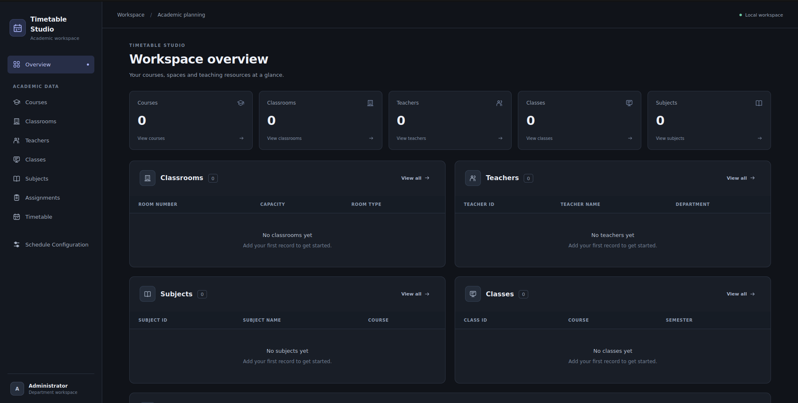
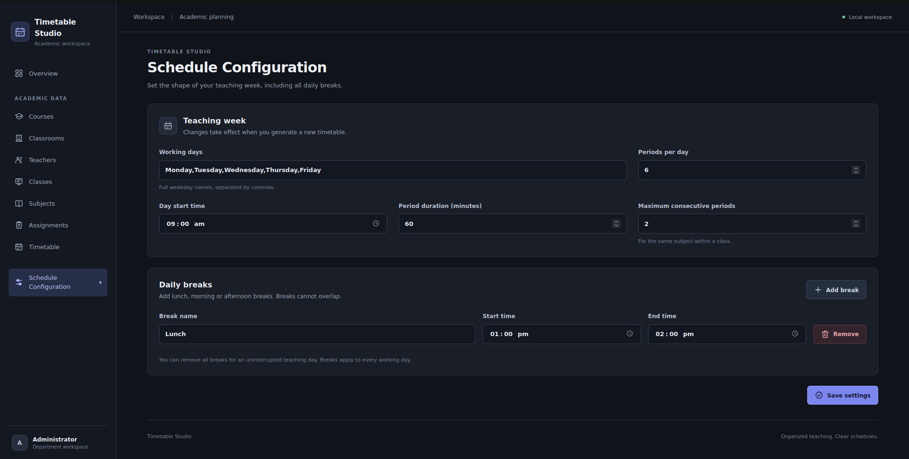
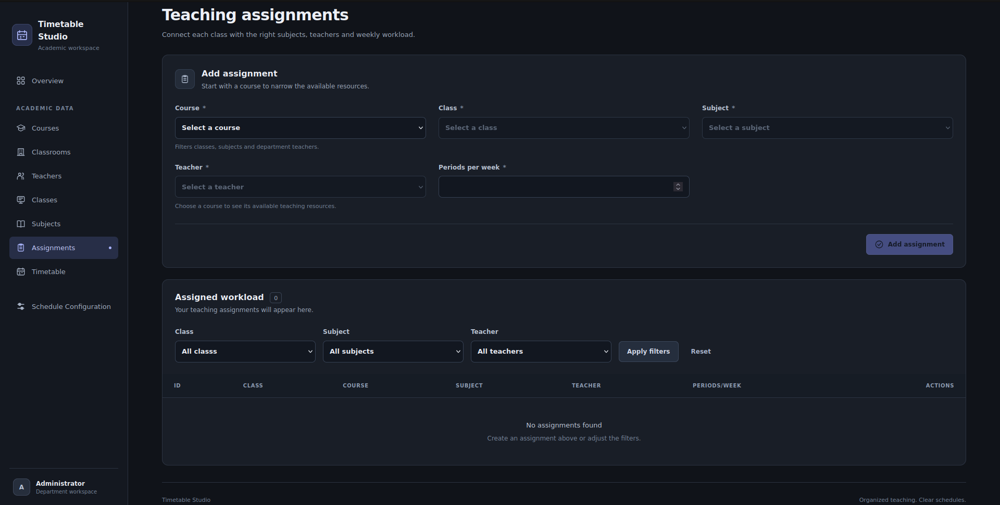
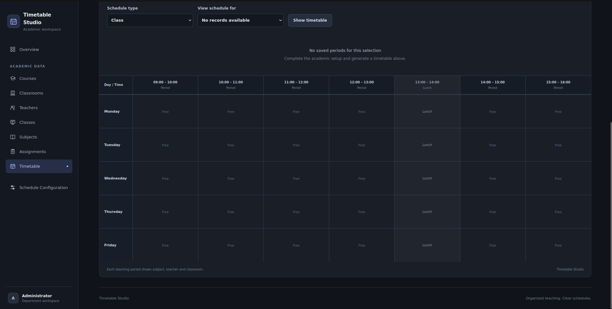

# CLASSROOM TIMETABLE MANAGEMENT SYSTEM

**Project README / Reference Document**

## Classroom Timetable Management System

A web-based Classroom Timetable Management System developed using Python, Flask, SQLite, HTML5, CSS3, and JavaScript. The application helps educational institutions manage courses, teachers, classrooms, classes, subjects, teaching assignments, scheduling rules, and automatically generated timetables through a professional web interface.

The system generates and stores conflict-free timetables while checking teacher availability, classroom availability, classroom capacity, required room type, weekly subject hours, and maximum consecutive-period constraints.

---

## Features

- Course and Department Management
- Teacher Management
- Classroom Management
- Class / Section Management
- Subject Management
- Subject-to-Class and Teacher Assignment
- Weekly Teaching-Hour Configuration
- Automatic Timetable Generation
- Conflict-Free Teacher Scheduling
- Conflict-Free Classroom Scheduling
- Classroom Capacity Validation
- Required Room-Type Validation
- Maximum Consecutive-Period Control
- Configurable Working Days
- Configurable Period Duration
- Configurable Multiple Breaks
- Timetable Views by Class, Teacher, and Classroom
- Search and Filter Support for Academic Records
- Record Editing and Deletion
- Dependency-Aware Record Deletion
- Incomplete / Damaged Record Detection and Repair Guidance
- Timetable Generation Validation
- Timetable Status Tracking
- Persistent SQLite Database Storage
- CSRF Protection for Form Submissions
- Professional Dark-Themed Web Interface

---

## Tech Stack

### Frontend

- HTML5
- CSS3
- JavaScript
- Jinja2 Templates

### Backend

- Python
- Flask

### Database

- SQLite

### Scheduling Engine

- Custom Python constraint-based scheduling algorithm
- Backtracking / bounded search
- Independent validation of generated schedules

---

## Project Structure

```text
CRT-Time-Table-Management/
│── app.py
│── requirements.txt
│── README.md
│── .gitignore
│── .python-version
│
├── database/
│   └── timetable.db              # Created locally at runtime
│
├── screenshots/
│   ├── assignments.png
│   ├── configuration.png
│   ├── dashboard.png
│   └── timetable.png
│
├── services/
│   ├── dependencies.py
│   └── scheduler.py
│
├── static/
│   ├── app.js
│   └── style.css
│
└── templates/
    ├── assignments.html
    ├── base.html
    ├── components.html
    ├── dashboard.html
    ├── edit.html
    ├── edit_assignment.html
    ├── manage.html
    ├── settings.html
    └── timetable.html
```

---

## Database Tables

The system uses SQLite to store academic data, scheduling configuration, teaching assignments, and generated timetable entries.

### Course Table

| Field | Description |
|---|---|
| Course ID | Unique course identifier |
| Course Name | Name of the course |
| Department | Department to which the course belongs |

### Teacher Table

| Field | Description |
|---|---|
| Teacher ID | Unique teacher identifier |
| Name | Teacher name |
| Department | Department associated with the teacher |

### Classroom Table

| Field | Description |
|---|---|
| Classroom No. | Unique classroom / room number |
| Capacity | Maximum number of students supported by the room |
| Room Type | Type of room, such as Lecture Room, Computer Lab, Science Lab, Seminar Hall, or Auditorium |

### Class Table

| Field | Description |
|---|---|
| Class ID | Unique class identifier |
| Course ID | Course associated with the class |
| Course Name | Stored course name associated with the class |
| Semester | Semester of the class |
| Section | Section of the class |
| Strength | Number of students in the class |

### Subject Table

| Field | Description |
|---|---|
| Subject ID | Unique subject identifier |
| Subject Name | Name of the subject |
| Course ID | Course to which the subject belongs |
| Required Room Type | Classroom type required for the subject |

### Subject Assignment Table

| Field | Description |
|---|---|
| Assignment ID | Auto-generated unique assignment identifier |
| Class ID | Class receiving the subject |
| Subject ID | Subject being taught |
| Teacher ID | Teacher assigned to the subject |
| Weekly Hours | Number of periods required per week |

Each assignment connects a **class**, **subject**, and **teacher** and specifies how many periods must be scheduled every week.

### Timetable Table

| Field | Description |
|---|---|
| Timetable ID | Auto-generated timetable entry identifier |
| Class ID | Class for which the period is scheduled |
| Day | Day of the week |
| Start Time | Period start time |
| End Time | Period end time |
| Subject ID | Scheduled subject |
| Teacher ID | Assigned teacher |
| Classroom No. | Assigned classroom |

The timetable table enforces uniqueness so that the same class, teacher, or classroom cannot be assigned to more than one activity at the same time.

### Settings Table

| Field | Description |
|---|---|
| Setting Key | Name of the scheduling setting |
| Setting Value | Stored value for that setting |

The settings table stores values such as working days, number of periods per day, starting time, period duration, breaks, maximum consecutive periods, timetable generation status, and saved timetable configuration.

---

## Timetable Generation Rules

Before a timetable is generated, the system checks the academic data and scheduling configuration.

The generation process considers:

- Each class must have valid subject assignments.
- A subject must belong to the same course as the selected class.
- The assigned teacher must belong to the appropriate department.
- Required weekly hours must fit within the available timetable slots.
- A teacher cannot teach two classes at the same time.
- A classroom cannot host two classes at the same time.
- A class cannot have two subjects at the same time.
- Classroom capacity must be greater than or equal to class strength.
- Classroom type must match the subject's required room type.
- The configured maximum number of consecutive periods must be respected.
- Break periods must not overlap.
- All generated teaching periods must remain within the configured day.

The scheduling engine performs a bounded constraint search and then independently validates the complete result before it is stored in the database.

---

## Application Workflow

1. Add Courses
2. Define Departments through Courses
3. Add Classrooms
4. Add Teachers
5. Add Classes
6. Add Subjects
7. Create Subject Assignments
8. Set Weekly Hours for Each Assignment
9. Configure Timetable Settings
10. Configure Working Days
11. Configure Period Duration and Start Time
12. Configure Breaks
13. Set Maximum Consecutive Periods
14. Validate Academic and Scheduling Data
15. Generate Timetable
16. Validate Generated Schedule
17. Store Timetable in SQLite
18. View Timetable by Class, Teacher, or Classroom
19. Edit Academic Data When Required
20. Regenerate the Timetable After Changes

---

## Working Flow

```text
Courses
   ↓
Classrooms
   ↓
Teachers
   ↓
Classes
   ↓
Subjects
   ↓
Subject Assignments
(Class + Subject + Teacher + Weekly Hours)
   ↓
Scheduling Settings
(Days + Periods + Duration + Breaks + Consecutive Limit)
   ↓
Input Validation
   ↓
Constraint-Based Timetable Generator
   ↓
Schedule Validation
   ↓
SQLite Timetable Storage
   ↓
Class / Teacher / Classroom Timetable Views
```

---

## Timetable Generation Process

### 1. Build Available Time Slots

The system creates timetable slots using the configured:

- Working days
- Number of periods per day
- Start time
- Period duration
- Break timings

Periods that would overlap configured breaks are shifted after the break.

### 2. Validate Input Data

Before scheduling starts, the system verifies that sufficient and valid data exists. It identifies issues such as:

- Classes without assignments
- Invalid or missing references
- Subjects without a suitable classroom
- Teacher workloads greater than available slots
- Class workloads greater than available slots
- Course, subject, and teacher mismatches

### 3. Find Valid Scheduling Options

For each teaching assignment, the scheduler searches for valid combinations of:

- Day
- Time slot
- Classroom

Assignments with fewer available choices are prioritized first to reduce scheduling conflicts.

### 4. Prevent Resource Conflicts

During generation, the scheduler ensures that:

- A class is used only once in a time slot.
- A teacher is used only once in a time slot.
- A classroom is used only once in a time slot.

### 5. Validate the Completed Timetable

Before replacing the saved timetable, the system independently checks the generated schedule to verify:

- Correct weekly workload
- Valid time slots
- Valid room capacity
- Correct room type
- No class conflicts
- No teacher conflicts
- No classroom conflicts
- Consecutive-period limits

### 6. Store the Timetable

After validation, the previous timetable is replaced inside a database transaction and the newly generated timetable is stored.

The application also records the timetable status and generation timestamp.

---

## Dependency-Aware Data Management

The application includes logic for handling relationships between records.

When a parent record such as a course, teacher, class, subject, or classroom is deleted, the system identifies dependent records and reports the impact.

Instead of silently deleting related academic history, affected foreign-key references can be cleared so that dependent records remain available for review and repair.

If timetable-related source data changes, the timetable is marked as **Outdated**, indicating that regeneration is required.

---

## User Interface

The application interface includes:

- Navigation Sidebar / Navigation Area
- Dashboard
- Summary Cards
- Data Management Tables
- Add Record Forms
- Edit Record Forms
- Search Boxes
- Filter Controls
- Status Indicators
- Validation Messages
- Subject Assignment Interface
- Timetable Generation Section
- Timetable Grid
- Class Timetable View
- Teacher Timetable View
- Classroom Timetable View
- Scheduling Settings Page
- Break Configuration Interface
- Dependency / Repair Notifications
- Dark-Themed Professional Layout

---

## Security and Data Integrity

The application includes several measures to protect data consistency:

- CSRF token validation for POST forms
- SQLite foreign-key enforcement
- Unique constraints for timetable resources
- Input validation for IDs and form values
- Transaction-based timetable replacement
- Transaction-based dependency-aware deletion
- Database rollback on failed operations
- Database migration support
- Backup creation during schema migrations
- Independent validation before generated timetable data is stored

---

## Installation

### 1. Clone the Project

```bash
git clone https://github.com/nihalprojectworkspace/CRT-Time-Table-Management.git
cd CRT-Time-Table-Management
```

### 2. Create a Virtual Environment

```bash
python3 -m venv .venv
```

### 3. Activate the Virtual Environment

#### Linux / macOS

```bash
source .venv/bin/activate
```

#### Windows

```bash
.venv\Scripts\activate
```

### 4. Install Dependencies

```bash
pip install -r requirements.txt
```

The current Python dependency is:

```text
Flask>=3.0,<4.0
```

### 5. Run the Application

```bash
python app.py
```

### 6. Open the Application

Open the local Flask address shown in the terminal, normally:

```text
http://127.0.0.1:5000/
```

The SQLite database and required tables are initialized automatically when the application starts.

---

## Screenshots









---

## Future Enhancements

- User Login and Authentication
- Administrator and Staff Roles
- Teacher Login
- Student Timetable Portal
- Manual Drag-and-Drop Timetable Editing
- Teacher Availability Preferences
- Classroom Availability Restrictions
- Elective Subject Scheduling
- Multiple Shifts
- Semester-Specific Academic Calendars
- Holiday Management
- Timetable Export to Excel
- Email Notifications
- Automatic Timetable Distribution
- REST API Support
- Multi-Department Scheduling
- Advanced Scheduling Optimization
- Cloud Database Deployment

---

## Learning Outcomes

- Python programming
- Flask web application development
- SQLite database design
- Relational database concepts
- HTML and CSS
- JavaScript
- Jinja2 templating
- CRUD operations
- Form validation
- Database transactions
- Foreign-key relationships
- Constraint-based problem solving
- Timetable scheduling algorithms
- Backtracking search
- Data integrity management
- Full-stack web application development

---

## Author

**Student Name:** Nihal Ranjan Gowda  
**USN:** U18IN24S0034  
**Course:** BCA  
**Project:** Classroom Timetable Management System

**Technologies:**  
Python | Flask | SQLite | HTML | CSS | JavaScript | Jinja2

---

## GitHub

https://github.com/nihalprojectworkspace/CRT-Time-Table-Management

---

## License

This project is developed for educational, academic, internship, and portfolio purposes.
